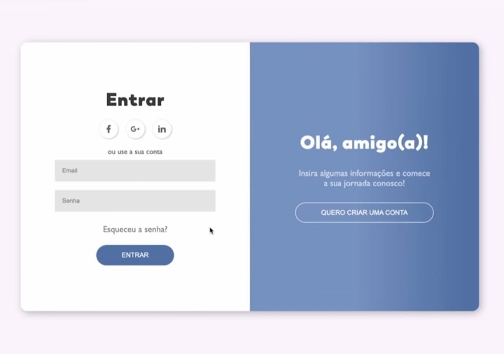
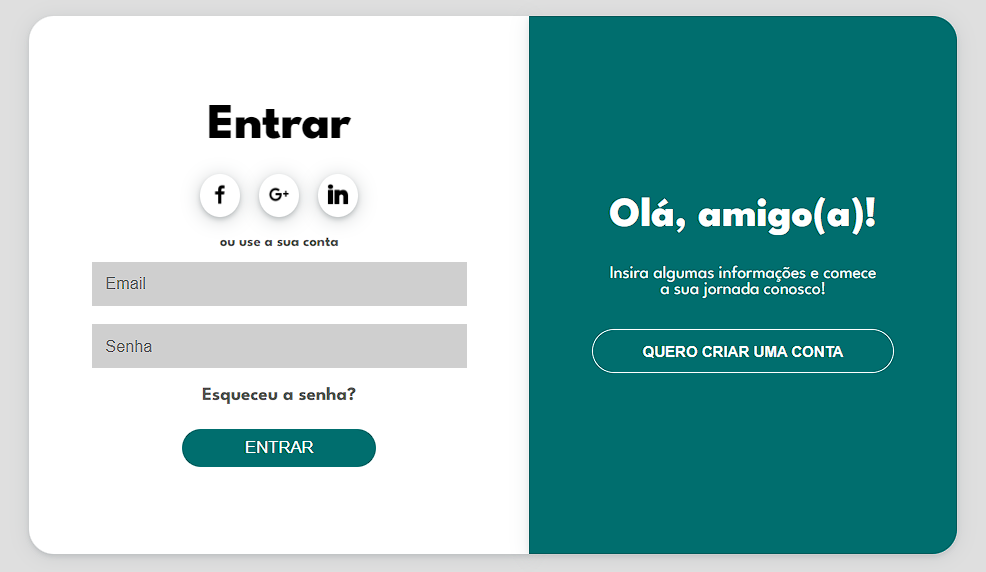

# Login Page

Esse é um projeto de uma página de login desenvolvida pra praticar HTML e CSS. A página foi feita a partir de uma referência encontrada na internet.

## 📄 Visão Geral

A página de login possui duas seções principais:
- **Seção da esquerda:** Formulário de login com opções para entrar com contas de redes sociais (Facebook, Google, LinkedIn) e um campo para recuperação de senha.
- **Seção da direita:** Uma mensagem de boas-vindas e um botão para criar uma nova conta.

## 🛠️ Tecnologias Utilizadas

- **HTML5:** Estrutura da página.
- **CSS3:** Estilização da página.
- **Google Fonts:** Fonte "League Spartan".
- **Icons8:** Ícones usados na página.

## ⚠️ Aviso

O site não tem interatividade. Os campos e botões não tem nenhuma função ativa.

## 📚 Referência
Esse projeto foi inspirado nesse design encontrado online:

* Os ícones foram fornecidos pelo [Icons8](https://icons8.com/icons/)

## 📸 Capturas de Tela
